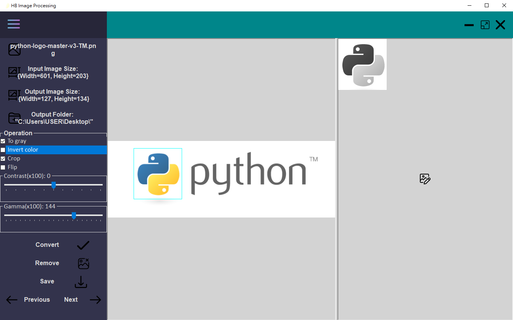

# HBImageProcessor

## 簡介：
使用C#寫成的Windows Forms應用程式。程式主要功能為圖片處理。 目前功能不多，以下為可使用的處理方法：  
- 將圖轉為灰階、顏色反轉及圖片翻轉
- 圖片裁切
- 調整對比度，以及Gamma校正
  
  ###
  

$\qquad$本身為程式新手，一開始開啟Visual Studio，根本不知道該怎麼使用環境和檔案配置。當然，現在也是一樣。
因此，我就僅上傳我認為較需要的code及檔案至github。如果有要在Visual Studio修改程式的話，則需再新建一個專案並將其import。

<br> 

### * 執行檔下載(約為97MB)：
無法提供。 Cannot provide.


### * 參考(Reference)： 
[1] [Emgucv # 24: How to crop an image using mouse selection in Emgu CV](https://youtu.be/n4mjLiMiSmw), AKHTAR JAMIL  
[2] [Modern Flat UI, Random MultiColor, Highlight button-Active Form, WinForm, C#, V-0.1](https://youtu.be/BtOEztT1Qzk), RJ Code Advance EN  

### * 特別致謝(Special thanks) :
#### - Zhao, Jian-Xiang  
  

##  

- 預覽圖：



---

## 開發工具及環境：  
  
### Microsoft Visual Studio Community 2022 (64 位元) - Current。版本 17.3.6。  
  
### 使用套件： 
> [1] Emgu.CV.runtime.windows。版本：4.6.0.5131  
> [2] Emgu.CV.UI。版本：4.6.0.5131  
  
### 專案類型：  
- Windows Forms應用程式  

Note: 沒有(.NET Framework)的那個哦
  
### 目標Framework：  
- .Net6.0-Windows

### 執行檔發佈設定： 
 
- 部屬模式：獨立式    
- 檔案發行選項：  
     - [v] 產生單一檔案  
     - [v] 啟用ReadyToRun編譯  
  
- .csproj：  
```
<IncludeNativeLibrariesForSelfExtract>true</IncludeNativeLibrariesForSelfExtract>
<EnableCompressionInSingleFile>true</EnableCompressionInSingleFile>
<DebugType>embedded</DebugType>
```

  
---
  
  
